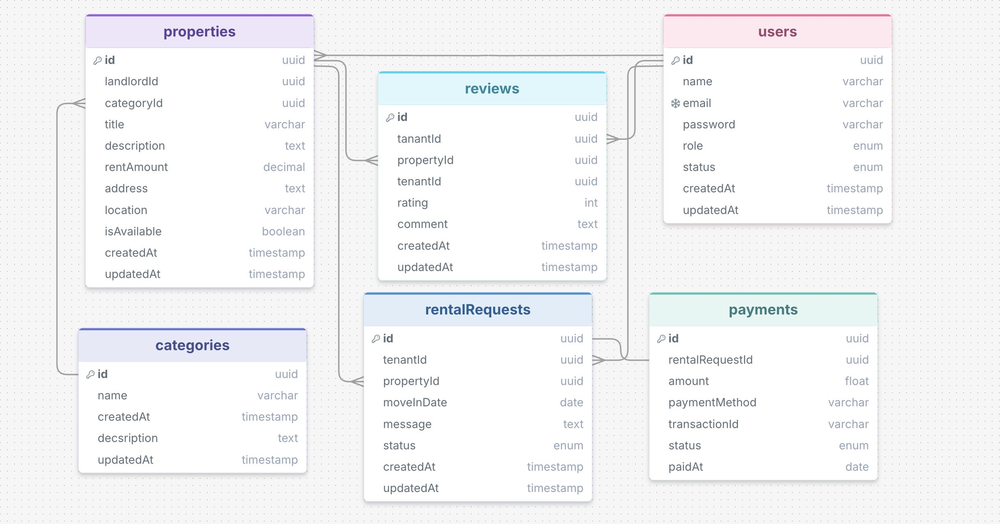

# 🏠 Rental Marketplace API - Backend

# 🛠 Tech Stack


---

## 📖 Project Description

**Rental Marketplace API** is a RESTful backend application built with **Express.js**, **TypeScript**, **Prisma ORM**, and **PostgreSQL**. It provides secure authentication, property management, rental requests, Stripe payment integration, reviews, and role-based access control for tenants, landlords, and administrators.

---

# ✨ Features

### 🔐 Authentication & Authorization

- User Registration
- Secure Login
- JWT Access Token Authentication
- Refresh Token Authentication
- Password Hashing with bcrypt
- Role-Based Access Control (RBAC)

---

### 👤 User Management

- Register as Tenant or Landlord
- View Own Profile
- Update Profile
- Delete Profile

---

### 🏡 Property Management

- Create Property Listing
- Update Property Information
- Delete Property
- View Property Details
- View All Available Properties
- View Own Listed Properties
- Search & Filter Properties
- Browse Property Categories

---

### 📩 Rental Request System

- Submit Rental Request
- View Rental Requests
- Landlord Approval or Rejection
- Prevent Duplicate Rental Requests
- Automatic Property Availability Management

---

### 💳 Secure Payment

- Stripe Checkout Integration
- Create Payment Session
- Complete Online Payment
- Store Payment Information

---

### ⭐ Review System

- Add Property Reviews
- Rate Rental Experience

---

### 👑 Admin Features

- View All Users
- Activate or Block Users
- Create Property Categories
- Monitor Platform Activities

---

### 📊 Tenant History

- View Tenant Rental History
- Accessible by Landlords and Admin

---

# 🚀 Deployment

The project is deployed on **Vercel**.

## 🚀 Live API

### Base URL

```text
https://rent-nest-chi.vercel.app/
```

> **Note:** This project is tested using the provided Postman Collection.

---

# ⚙️ Installation

## Clone the repository

```bash
git clone https://github.com/Zobaida-Jim/Rental-Marketplace-API
```

## Navigate to the project directory

```bash
cd Rental-Marketplace-API
```

## Install dependencies

```bash
npm install
```

## Generate Prisma Client

```bash
npx prisma generate
```

## Run Database Migration

```bash
npx prisma migrate dev
```

## Start Development Server

```bash
npm run dev
```

## Build Project

```bash
npm run build
```

---

## 🔐 Environment Variables

Copy **`.env.example`** to **`.env`** and update the required values.

```bash
cp .env.example .env
```

---

# 📂 Project Structure

```text
Rental_Marketplace_API/
├── prisma/
│   ├── migrations/
│   └── schema/
│       ├── category.prisma
│       ├── enum.prisma
│       ├── payment.prisma
│       ├── property.prisma
│       ├── rentalRequest.prisma
│       ├── review.prisma
│       ├── schema.prisma
│       └── user.prisma
│
├── src/
│   ├── config/
│   │   └── index.ts
│   │
│   ├── lib/
│   │   ├── prisma.ts
│   │   └── stripe.ts
│   │
│   ├── middleware/
│   │   ├── auth.ts
│   │   ├── globalErrorHandler.ts
│   │   └── notFoundRoute.ts
│   │
│   ├── modules/
│   │   ├── admin/
│   │   ├── landlordManagement/
│   │   ├── payments/
│   │   ├── property/
│   │   ├── rentalRequest/
│   │   ├── review/
│   │   └── user/
│   │
│   ├── utils/
│   │   ├── blockedStatus.ts
│   │   ├── catchAsync.ts
│   │   ├── jwt.ts
│   │   └── sendResponse.ts
│   │
│   ├── app.ts
│   └── server.ts
│
├── .env
├── package.json
├── package-lock.json
├── prisma.config.ts
├── tsconfig.json
├── tsup.config.ts
├── vercel.json
└── README.md
```

---

# 🔐 Authentication

Handles user registration, authentication, token generation, and profile management.

| Method | Endpoint | Access | Description |
|---------|----------|--------|-------------|
| POST | `/api/auth/register` | Public | Register a new tenant or landlord or admin account. |
| POST | `/api/auth/login` | Public | Authenticate a user and return access & refresh tokens. |
| POST | `/api/auth/refresh-token` | Public | Generate a new access token using a valid refresh token. |
| GET | `/api/auth/me` | User | Retrieve the authenticated user's profile information. |
| PUT | `/api/auth/my-profile` | User | Update the authenticated user's profile information. |
| DELETE | `/api/auth/delete` | User | Delete the authenticated user's account permanently. |

---

# 🏡 Property Management

Allows landlords to manage properties while tenants can browse available listings.

| Method | Endpoint | Access | Description |
|---------|----------|--------|-------------|
| GET | `/api/properties` | Public | Retrieve all available properties with optional filtering and searching. |
| GET | `/api/properties/:propertyId` | Public | Retrieve detailed information for a specific property. |
| GET | `/api/properties/categories` | Admin & Landlord | Retrieve all available property categories. |
| POST | `/api/landlord/properties` | Landlord | Create a new rental property listing. |
| PUT | `/api/landlord/properties/:propertyId` | Landlord | Update an existing property owned by the landlord. |
| DELETE | `/api/landlord/properties/:propertyId` | Landlord | Delete one of the landlord's own properties. |
| GET | `/api/landlord/my-properties` | Landlord | Retrieve all properties created by the authenticated landlord. |

---

# 📩 Rental Requests

Enables tenants to request properties and landlords to manage those requests.

| Method | Endpoint | Access | Description |
|---------|----------|--------|-------------|
| POST | `/api/rentals` | Tenant | Submit a rental request for a property. |
| GET | `/api/rentals` | User | Retrieve rental requests related to the authenticated user. |
| PATCH | `/api/landlord/requests/:requestId` | Landlord | Approve or reject a rental request. |

---

# 💳 Payments

Stripe payment integration for approved rental requests.

| Method | Endpoint | Access | Description |
|---------|----------|--------|-------------|
| POST | `/api/payments/create` | Tenant | Create a Stripe Checkout Session for an approved rental request. |

---

# ⭐ Reviews

Allows tenants to review rented properties.

| Method | Endpoint | Access | Description |
|---------|----------|--------|-------------|
| POST | `/api/reviews` | Tenant | Submit a rating and review for a property after completing the payment process. |

---

# 👑 Admin

Administrative endpoints for managing the platform.

| Method | Endpoint | Access | Description |
|---------|----------|--------|-------------|
| GET | `/api/admin/users` | Admin | Retrieve all registered users. |
| PATCH | `/api/admin/users/:userId` | Admin | Update a user's account status (Active/Blocked). |
| POST | `/api/admin/create-category` | Admin | Create a new property category. |

---

# 📊 Tenant History

Allows landlords and administrators to view a tenant's rental history.

| Method | Endpoint | Access | Description |
|---------|----------|--------|-------------|
| GET | `/api/landlord/tenant/:tenantId` | Landlord, Admin | Retrieve the rental history of a specific tenant. |

---

# 🔍 Property Search & Filters

The property listing endpoint supports multiple query parameters for searching and filtering results.

### Endpoint

```http
GET /api/properties
```

### Supported Query Parameters

| Parameter | Type | Description |
|-----------|------|-------------|
| location | string | Filter properties by location. |
| type | string | Filter by property type. |
| category | string | Filter by property category. |
| minPrice | number | Minimum rental price. |
| maxPrice | number | Maximum rental price. |
| isAvailable | boolean | Filter available or unavailable properties. |
| amenities | string[] | Filter properties by amenities. |

### Example Request

```http
GET /api/properties?location=Dhaka&minPrice=10000&maxPrice=30000&isAvailable=true&amenities=["WiFi"]
```

---

# 👥 User Roles

| Role | Permissions |
|------|-------------|
| **ADMIN** | Manage users, create categories, monitor the platform. |
| **LANDLORD** | Manage properties, approve/reject rental requests, view tenant history. |
| **TENANT** | Browse properties, submit rental requests, make payments, submit reviews. |


# 📌 API Documentation

The Rental Marketplace API is organized into modules based on user roles and functionalities. Most protected routes require JWT authentication.

- **Request Body** – Required input fields.
- **Authorization Header** – `Bearer <access_token>` (recommended) or raw access token.
- **Cookies** – `accessToken` cookie (if applicable).
- **Path Parameters** – Resource ID (e.g., `/properties/:id`).
- **Query Parameters** – Filters, search, and pagination (if supported).

---

# 🔄 API Workflow

The following diagram illustrates the overall workflow of the RentNest platform.

```text
                  Register
                      │
                      ▼
                   Login
                      │
                      ▼
             JWT Authentication
                      │
        ┌─────────────┴─────────────┐
        │                           │
        ▼                           ▼
   Landlord                    Tenant
        │                           │
Create Property             Browse Properties
        │                           │
        │                   Create Rental Request
        │                           │
        └──────────────┬────────────┘
                       ▼
          Landlord Reviews Request
                       │
            ┌──────────┴──────────┐
            │                     │
         Approved             Rejected
            │
            ▼
   Create Stripe Session
            │
            ▼
     Complete Payment
            │
            ▼
      Submit Review
```

---


# 💳 Stripe Payment Flow

Stripe is integrated to securely process rental payments.

```text
Tenant
    │
    ▼
Create Rental Request
    │
    ▼
Landlord Approves Request
    │
    ▼
Create Stripe Checkout Session
    │
    ▼
Redirect to Stripe Checkout
    │
    ▼
Payment Successful
    │
    ▼
Payment Stored in Database
    │
    ▼
Rental Completed
```

---

# 🗄️ Entity Relationship Diagram (ERD)

The database schema for RentNest is illustrated below.

> Replace the image path with your uploaded ER diagram.

```md
<p align="center">
    
</p>
```

---

# 📦 Postman Collection

A complete **Postman Collection** is included in this repository to simplify API testing.

Import the collection into Postman and configure your environment variables before testing.

---


# 👨‍💻 Author

**Zobaida Jim**

Computer Science & Engineering Student

- LinkedIn: https://www.linkedin.com/in/zobaida-jim/